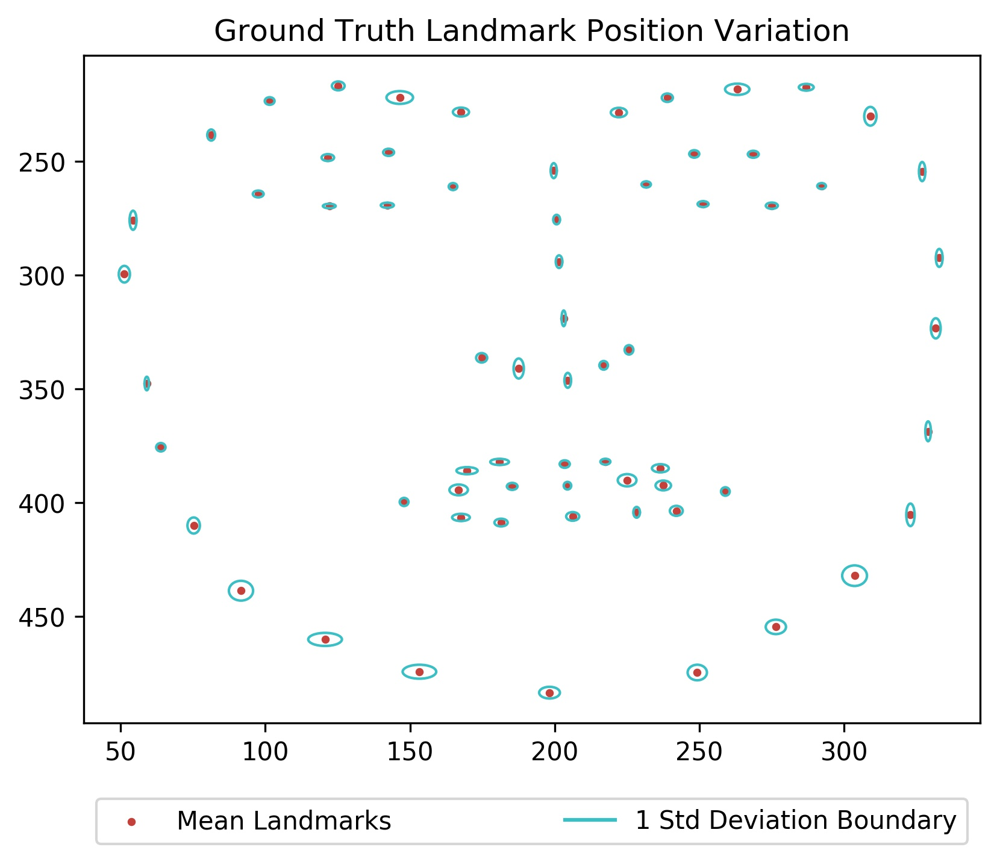

# Stage 2: Dataset Selection
## Ground Truth Reliability

This folder contains the code used to produce Figures 4 & 5 in the "Ground Truth" landmark reliability study of **Stage
2: Data Selection**.

Figure 4: 

Figure 5: 

### Folder Structure

- **requirements.txt**: Python package requirements file.  If you wish to run the code provided for this section you
will need to install the required packages.  It is recommended that you use install the requirements within a virtualenv, otherwise to install use:
        <code>pip install --user -r requirements.txt</code>
- **plot_figures.py**: Python file to run <code>python plot_figures.py</code>
- **display_image.jpg**:  The image Workers were asked to landmark during the survey
- **raw_data**: this folder contains the ground truth coordinates as specified by the mechanical Turk workers within csv
  files as well as an image representation of the selected coordinates.  The filename structure for these files is as
  follows:

        YYYY-mm-dd-HH:MM:SS_{WORKER_ID}.csv

        YYYY-mm-dd-HH:MM:SS_{WORKER_ID}.jpg

### Operating Environment
This code was executed on Solus Linux using Python 3.6 and the installed requirements from **requirements.txt** within a
virtual environment
